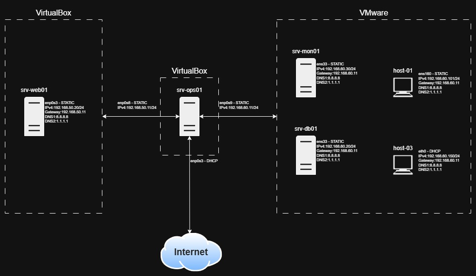

# Homelab

This project is my personal test environment (homelab), where I expand my knowledge in Linux system administration and technologies commonly used in the daily work of system administrators and DevOps engineers.

## Repository structure

- `README.md` – project overview,
- `docs/` – notes, troubleshooting logs, general information,
- `devices/` – example configuration files and detailed descriptions of performed tasks;

## Infrastructure diagram

A visual representation of the current homelab architecture:

> The file `network_diagram.jpg` is located in the `devices/` directory.
